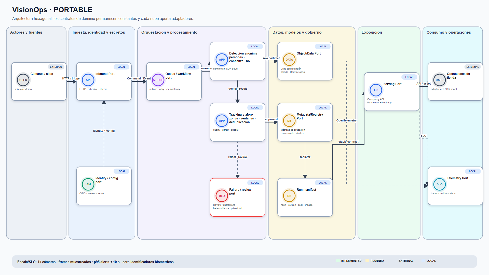
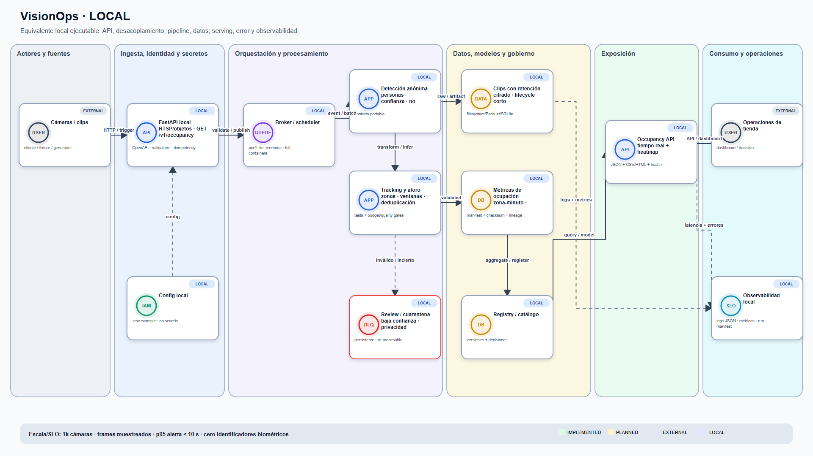
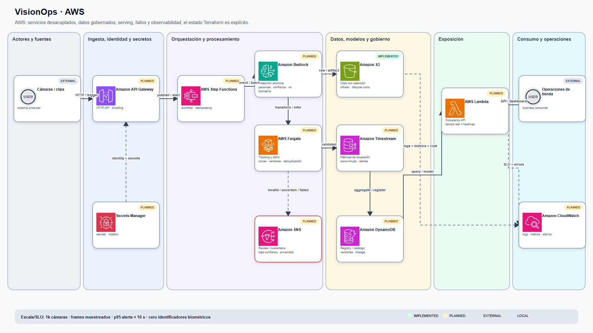
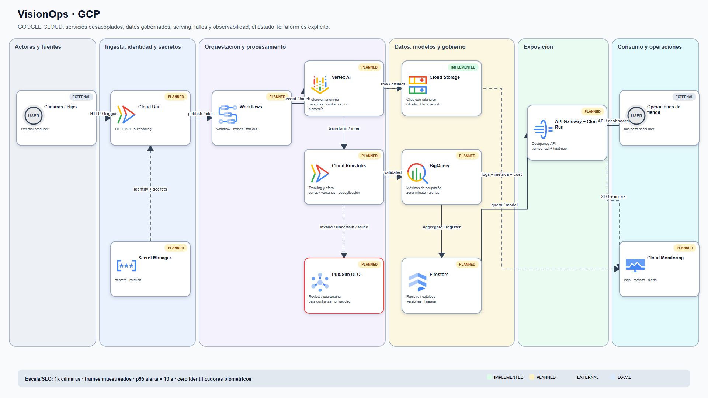
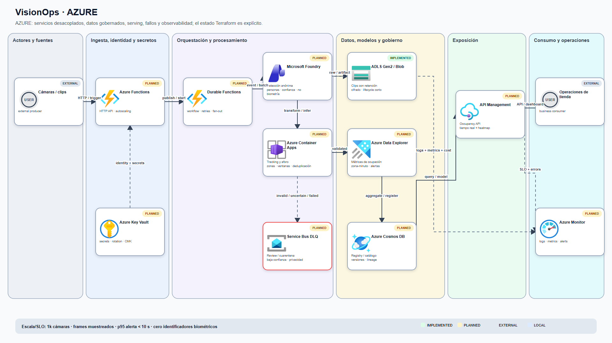
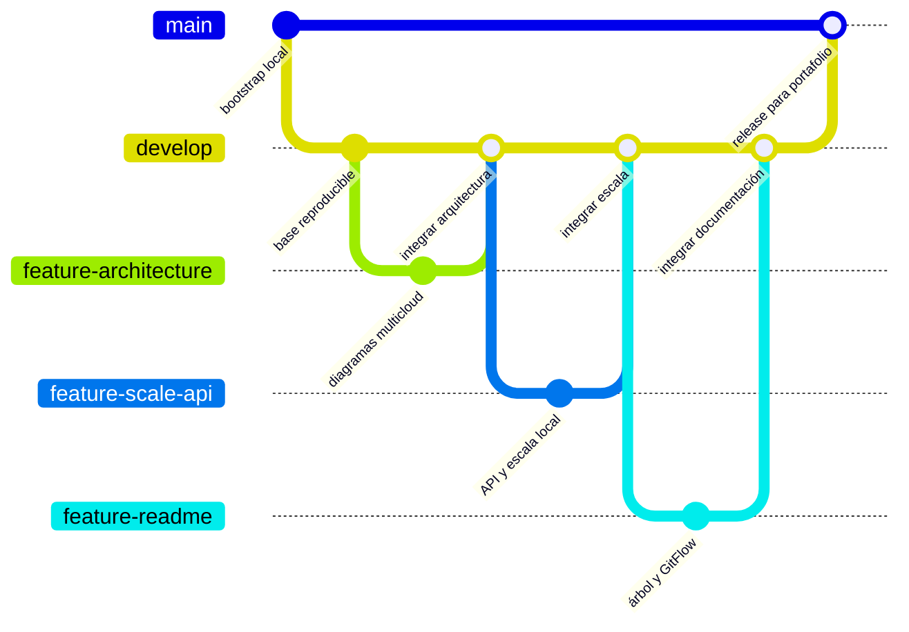

# VisionOps — Analítica de ocupación por video con privacidad

> **AI-03 · AI Engineering · AWS + GCP + Azure · Terraform**

Estado: **MVP local ejecutable**. La infraestructura está preparada para validación y plan; ningún recurso de nube se crea por defecto.

## El problema y el resultado

**Propósito:** Transformar detecciones anónimas en ocupación por zona y alertas de capacidad, sin biometría.

**Lo que sorprende en una entrevista:** Demuestra visión aplicada y privacy-by-design: conserva conteos y trazas anónimas, no rostros.

Flujo funcional: `Detecciones anónimas → Validar privacidad → Rastrear → Contar zonas → Detectar aforo → Exportar → Ocupación y alertas`.

## Demo local en menos de cinco minutos

Requisitos: Python 3.12+ y PowerShell 7 o Windows PowerShell. Docker es opcional.

```powershell
git clone https://github.com/danielyatacoblas/visionops-multicloud.git
cd visionops-multicloud
./scripts/bootstrap.ps1
./scripts/test.ps1
./scripts/demo.ps1
```

La demo escribe resultados reproducibles en `artifacts/`. No usa credenciales, APIs de pago ni servicios cloud. Una ejecución de referencia ya versionada está en [`docs/demo/sample-output`](docs/demo/sample-output).

También funciona de forma directa:

```powershell
$env:PYTHONPATH = "src"
python -m visionops --input data/sample --output artifacts
python -m pytest -q
```

## Arquitectura portable



Fuente editable: [Mermaid](diagrams/src/portable.mmd) · [SVG vectorial](diagrams/rendered/portable.svg).

El dominio bajo `src/visionops` no importa SDKs cloud. Los futuros adaptadores implementan los mismos puertos y conservan el mismo contrato de entrada/salida.

## Ejecución local



Fuente editable: [Mermaid](diagrams/src/local.mmd) · [SVG vectorial](diagrams/rendered/local.svg).

El dataset incluido es pequeño, sintético y versionado. Los tests cubren el comportamiento decisivo del producto, no solamente que el proceso termine.

## AWS



Fuente editable: [Mermaid](diagrams/src/aws.mmd) · [SVG vectorial](diagrams/rendered/aws.svg).

```powershell
./scripts/preflight.ps1 -Cloud aws
Copy-Item infra/aws/environments/demo/terraform.tfvars.example infra/aws/environments/demo/terraform.tfvars
./scripts/terraform-plan.ps1 -Cloud aws
# Solo después de revisar el plan: terraform -chdir=infra/aws apply tfplan
```

Recursos reales permanecen apagados con `enable_cloud_resources = false`. Configuración pendiente: cuenta, región, identidad OIDC, backend remoto, presupuesto y validación del servicio administrado específico.

## GCP



Fuente editable: [Mermaid](diagrams/src/gcp.mmd) · [SVG vectorial](diagrams/rendered/gcp.svg).

```powershell
./scripts/preflight.ps1 -Cloud gcp
Copy-Item infra/gcp/environments/demo/terraform.tfvars.example infra/gcp/environments/demo/terraform.tfvars
./scripts/terraform-plan.ps1 -Cloud gcp
# Solo después de revisar el plan: terraform -chdir=infra/gcp apply tfplan
```

Recursos reales permanecen apagados. Configuración pendiente: proyecto, región, Workload Identity Federation, APIs, backend remoto y presupuesto.

## Azure



Fuente editable: [Mermaid](diagrams/src/azure.mmd) · [SVG vectorial](diagrams/rendered/azure.svg).

```powershell
./scripts/preflight.ps1 -Cloud azure
Copy-Item infra/azure/environments/demo/terraform.tfvars.example infra/azure/environments/demo/terraform.tfvars
./scripts/terraform-plan.ps1 -Cloud azure
# Solo después de revisar el plan: terraform -chdir=infra/azure apply tfplan
```

Recursos reales permanecen apagados. Configuración pendiente: suscripción, tenant, región, federated credential, backend remoto, presupuesto y cuota.

## Qué crea Terraform hoy

Cada carpeta contiene proveedores fijados, variables, etiquetas, guardas de seguridad y una base de almacenamiento opcional. `terraform plan` usa `enable_cloud_resources=false`; por eso el primer plan es seguro y no crea nada. Los servicios gestionados del flujo completo están marcados como `PENDING_CLOUD_VALIDATION` en `docs/PENDING_CLOUD.md`.

## Evidencia y calidad

- `tests/`: pruebas unitarias del caso de negocio.
- `artifacts/`: resultados locales regenerables; no se versionan.
- `docs/demo/`: evidencia pequeña que sí puede mostrarse en GitHub.
- `diagrams/src/`: Mermaid editable.
- `diagrams/rendered/`: SVG exportado y visible en GitHub.
- `.github/workflows/ci.yml`: tests y `terraform fmt -check`, sin despliegue.

## Estructura del proyecto

El repositorio separa dominio, datos, automatización, evidencia e infraestructura.
La misma lógica local se conserva al sustituir los adaptadores por servicios de
AWS, Azure o Google Cloud.

```text
visionops-multicloud/
├── .github/
│   └── workflows/ci.yml         # Pruebas, diagramas y Terraform por cada push o PR
├── data/
│   └── sample/                  # Dataset mínimo versionado para la demostración
├── diagrams/
│   ├── architecture.json        # Inventario verificable de nodos, flujos y estados
│   ├── src/                     # Mermaid: local, portable, AWS, Azure y GCP
│   ├── rendered/                # Diagramas exportados en PNG y SVG
│   └── icons/                   # Iconos oficiales de los tres proveedores
├── docs/
│   ├── demo/                    # Salidas pequeñas y reproducibles
│   ├── evidence/local-100k.json # Métricas, hashes, hardware y limitaciones
│   ├── CV_PROJECT.md            # Explicación para CV y entrevista
│   ├── SCALE_AND_API.md         # Contrato de escala y API bulk
│   └── PENDING_CLOUD.md         # Configuraciones que requieren una cuenta cloud
├── infra/
│   ├── aws/                     # Terraform, variables, outputs y tests AWS
│   ├── azure/                   # Terraform, variables, outputs y tests Azure
│   └── gcp/                     # Terraform, variables, outputs y tests GCP
├── scripts/
│   ├── bootstrap.ps1            # Preparación del entorno local
│   ├── demo.ps1                 # Demostración del flujo de negocio
│   ├── generate_load.py         # Generador NDJSON determinista y particionado
│   ├── benchmark_api.py         # Prueba HTTP real con idempotencia
│   ├── run_scale.py             # Procesamiento streaming y dashboard
│   └── render_diagrams.py       # Generación y verificación de diagramas
├── src/
│   └── visionops/
│       ├── pipeline.py          # Detecciones anónimas, ocupación y privacidad
│       ├── api.py               # FastAPI: health, métricas e ingesta bulk
│       ├── scale_config.py      # Contrato y generador específico del dominio
│       └── scale_runtime.py     # Particiones, checksums y agregación acotada
├── tests/                       # Dominio, arquitectura, escala, API y Terraform TDD
├── compose.yaml                 # Demo y API local mediante contenedores
├── Dockerfile                   # Imagen de la demostración
├── Dockerfile.api               # Imagen de la API
├── CONTRIBUTING.md              # Política GitFlow y controles para pull requests
├── Makefile                     # Comandos abreviados de desarrollo
└── README.md                    # Entrada principal para reclutadores
```

## GitFlow

El historial aplica GitFlow: el desarrollo ocurre fuera de `main`, las ramas de
funcionalidad regresan a `develop` mediante merge y sólo una versión validada se
promueve a `main`.



| Rama | Responsabilidad | Regla de salida |
|---|---|---|
| `main` | Versión estable que ve primero un reclutador | Sólo recibe releases verificadas desde `develop` o correcciones urgentes |
| `develop` | Integración continua del siguiente incremento | Debe conservar pruebas, diagramas y Terraform en estado válido |
| `feature/*` | Cambio acotado de aplicación, datos, MLOps, infraestructura o documentación | Pull request hacia `develop`; se elimina al integrarse |
| `release/*` | Estabilización opcional antes de publicar una versión | Sólo correcciones, documentación y preparación de versión |
| `hotfix/*` | Corrección urgente creada desde `main` | Se integra tanto en `main` como en `develop` |

Flujo exigido para cada cambio:

1. Crear `feature/<nombre-corto>` desde `develop`.
2. Implementar el cambio junto con pruebas y documentación.
3. Abrir un pull request hacia `develop`.
4. Exigir CI correcto: pruebas locales, consistencia de diagramas y Terraform seguro.
5. Integrar con merge no fast-forward para conservar la decisión arquitectónica.
6. Promover `develop` a `main` únicamente cuando la entrega sea demostrable.
7. Crear un tag semántico cuando exista una versión desplegada o una línea base formal.

El gráfico refleja las ramas reales usadas para la arquitectura detallada y la
ruta de escala/API. Consulta [CONTRIBUTING.md](CONTRIBUTING.md) para los controles
de pull request y las reglas sobre evidencia cloud.
## Seguridad y costos

No se versionan secretos ni credenciales. Los ejemplos usan nombres no sensibles. Antes de desplegar se debe configurar autenticación federada, alertas de presupuesto, límites de cuota, retención y un comando de destrucción verificado. No se afirma que una integración cloud esté probada hasta guardar evidencia real.

## Estado honesto

| Alcance | Estado |
|---|---|
| Pipeline y pruebas locales | `LOCAL_VERIFIED` después de ejecutar `scripts/test.ps1` |
| Diagramas Mermaid + SVG | Incluidos |
| Terraform estático | Incluido; se valida sin `apply` |
| Despliegue AWS/GCP/Azure | `PENDING_CLOUD_VALIDATION` |
| URL del repositorio | [GitHub](https://github.com/danielyatacoblas/visionops-multicloud) |

## Licencia y datos

Código preparado para publicarse bajo MIT cuando el propietario confirme el año/nombre legal. Los datos actuales son fixtures sintéticos; cualquier fuente pública futura debe registrarse con licencia y fecha de descarga.

## Escala y API verificables

Este repositorio incluye una ruta reproducible para generar y procesar datos por particiones, además de `POST /v1/detections/bulk` con NDJSON, idempotencia persistente, límites y métricas. Consulta [Escala y API](docs/SCALE_AND_API.md) y [Ficha de CV](docs/CV_PROJECT.md).

```powershell
pip install -e ".[dev]"
python scripts/generate_load.py --profile smoke
python scripts/run_scale.py
python scripts/serve_api.py
```

Los perfiles `medium` y `large` no se ejecutan automáticamente en CI para controlar tiempo y costo; sus artefactos no se versionan. Cada cifra publicada debe proceder de `artifacts/scale-report/scale-run.json`.

## Evidencia local medida

El 6 de agosto de 2026 se verificaron **100 000 registros**: procesamiento streaming a **111,793 registros/s** y ruta HTTP bulk a **23,797 registros/s**, incluyendo arranque del servidor. La repetición idempotente no duplicó registros. Consulta [`docs/evidence/local-100k.json`](docs/evidence/local-100k.json) para hardware, hashes, comandos y limitaciones. Estas cifras son locales y no representan rendimiento cloud.
